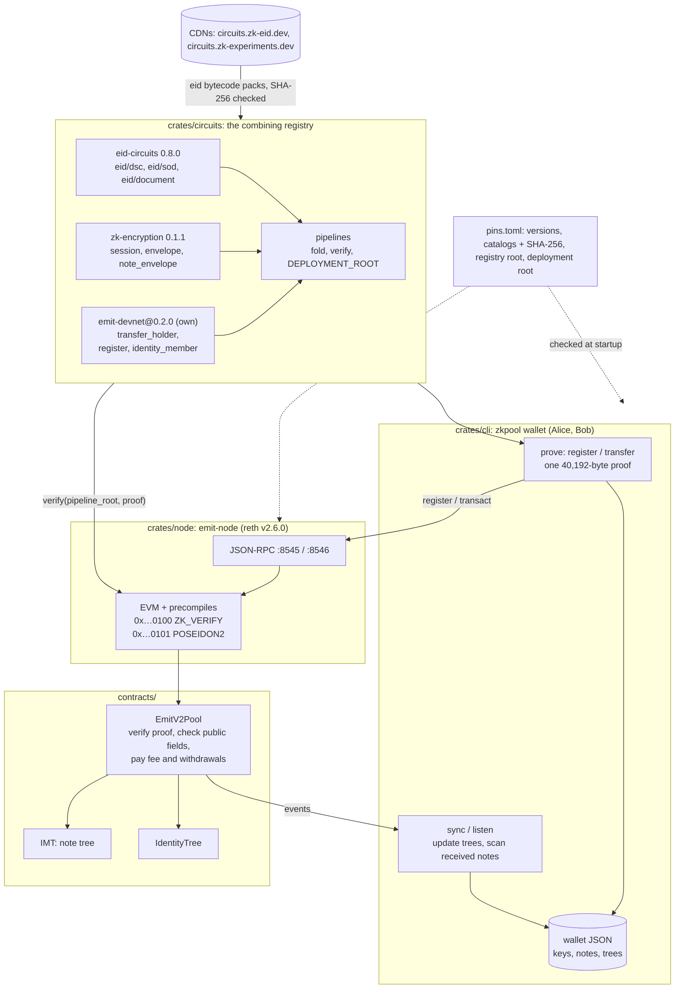
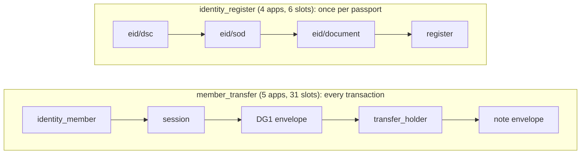

# emit-devnet

The Emit V2 private transfer, end to end on a local chain: a reth dev node whose EVM verifies folded Chonk proofs (`ZK_VERIFY`) and hashes with the circuits' Poseidon2 (`POSEIDON2`), a private note pool contract, and a console wallet (`zkpool`) with which Alice and Bob, each bound to a synthetic passport, deposit, pay each other on the post-quantum channel, split, merge and withdraw. Each holder first registers in the pool's identity cache, proving the passport once (`identity_register`: eid's steps, then the registration); every transaction after that is one proof folded with noir-zk's generic kernels, of `member_transfer` (membership in the identity tree, the channel session, DG1 sealed, the 2-in / 2-out JoinSplit bound to the registered key, and its note opening sealed; see [The identity cache](#the-identity-cache)). Every note is 0 or at least 1/3 ETH.

Design: `emit-v2-transfer-mechanism.md` and `emit-private-transfer-design.md` (the Outbe notes); the circuits and wallet logic come from the `postquantum-zk-encryption-experiment` repository, the channel from [zk-encryption](https://github.com/zk-experiments/zk-encryption), the identity layer from [eid-circuits](https://github.com/zk-experiments/eid-circuits), the pipelines from [noir-zk](https://github.com/zk-experiments/noir-zk).

## Architecture



- `ZK_VERIFY(pipeline_root ‖ proof)` returns the proof's `uint256[35]` public fields or reverts. `POSEIDON2(x₁..xₙ)` is Noir's sponge.
- `EmitV2Pool` calls `ZK_VERIFY`, then checks every public field against the calldata: ctx, `H(pqCiphertext)`, roots, nullifiers, the identity root (the registry root, date and scope for a registration), the date and `msg.value`. It pays the fee to `block.coinbase` and `vPubOut` to the payout address.
- Both trees are `IMT`s of depth 32 that keep every root they had: a proof against an older root stays valid.
- The wallet follows `NewCommitment`, `NewNullifier`, `Envelope` and `IdentityRegistered`. `Receiver::scan` recovers the notes sent to it and the sender's MRZ.
- The wallet JSON holds `sk`, the Receiver and Senders, the notes, the registration, and each tree's frontier with the paths of the wallet's own leaves.

The pipelines, each folded into one proof by noir-zk's generic kernels:



Setup: the eid DSC/SOD/document bytecode comes from the packs on circuits.zk-eid.dev (catalog SHA-256 pinned, pack SHA-256 from the catalog, every file checked against eid's registry pins); the channel layer's release is v0.1.1, whose frozen library identity is still `zk-encryption@0.1.0`.

```
crates/circuits/   build.rs (codegen), circuits/manifest.toml (own and wrapped families, pipelines),
                   noir/ (apps transfer_holder, register, identity_member; lib/emit,
                   lib/identity_cache), resources/ + assets/ (frozen keys, ABIs, bytecode),
                   src/{lib.rs, pins.rs, setup.rs}
crates/node/       src/main.rs (reth CLI + EVM factory), src/precompiles.rs, tests/devnet.rs
crates/cli/        src/{main.rs, wallet.rs, chain.rs, emit.rs, identity.rs, tree.rs, document.rs},
                   fixtures/documents.json (six synthetic passports), tests/cli.rs
contracts/         src/{IMT.sol, EmitV2Pool.sol}, test/EmitV2Pool.t.sol, script/Deploy.s.sol
scripts/           devnet.sh (node + deploy), demo.sh (the whole flow, checked), srs.sh (bb's CRS)
.github/workflows/ ci.yml (every test, the proving and devnet ones included)
genesis.json       chain 3607, Prague from genesis, 300M gas limit, three funded dev accounts
pins.toml
```

## Pins and where each artefact comes from

`pins.toml` is compiled into the node and the wallet and checked at startup (`crates/circuits/src/pins.rs`): the node refuses to start and the wallet refuses to prove if a check fails (`emit-node node --pins-offline` checks only the local ones).

| what | version / pin | from | checked |
|---|---|---|---|
| noir-zk (core, backend, codegen, kernels) | `=0.3.0` | crates.io | kernels family root `0x0eb7f815…937f` and version |
| this repository's layers (emit: transfer_holder; identity_cache: register, member) | `emit-devnet@0.2.0`, family roots `transfer_holder` `0x2a50870b…e27a`, `register` `0x127dc46e…6c41`, `member` `0x03f6f187…64be` | this repository (`crates/circuits/noir`, frozen with `noir-zk freeze`, bytecode bundled) | library and every family root; bytecode against its pin when loaded |
| channel layer | release `v0.1.1` (library `zk-encryption@0.1.0`, on noir-zk 0.3.0 from crates.io) | bytecode bundled in `zk-encryption-circuits`; catalog `https://circuits.zk-experiments.dev/zk-encryption/0.1.1/catalog.json` | catalog SHA-256 `d0ff52a1…43b5`; its families' roots equal the compiled-in ones |
| identity layer | `eid-circuits@0.8.0`, git tag `v0.8.0` (`eid-circuits`, `eid-prover`) | DSC, SOD and document steps: packs on `https://circuits.zk-eid.dev`, catalog `catalog@0.8.0.json` | catalog SHA-256 `f9119063…e092`, its version and its DSC/SOD/document labels in eid's registry; each pack's SHA-256 against the catalog; every unpacked `.b64` / `.vk` against eid's registry pins |
| CSCA registry | tag `registry-20260928-1039`, root `0x27bef40a…02a2` | `https://registry.zk-eid.dev/<tag>/registry.json` | file SHA-256 `17a21c0f…4444` and `commitment.root` |
| deployment | root `0x0f5a24c0…d8a2`; `identity_register` `0x12bb22de…c445` (4); `member_transfer` `0x23410103…606a` (5) | computed by the codegen | equal to the generated constants |
| toolchain | nargo 1.0.0-rc.3, bb 7.0.0-nightly.20260927 (via `barretenberg-rs`), reth v2.6.0, solc 0.8.30 | noirup / `cargo install`, crates.io, git tag | nargo 1.0.0-rc.3 and noir-zk-cli 0.3.0 only to refreeze this repo's layers: `nargo compile --workspace` in `crates/circuits/noir`, then `noir-zk freeze --target noir/target --out . --assets assets --library emit-devnet@0.2.0` in `crates/circuits` (CI runs it with `--check`) |

Caches: `~/.cache/emit-devnet` (`$EMIT_DEVNET_CACHE`): the pinned files, eid's unpacked packs (the demo needs common, rsa4096, rsa2048, bp384, bp256: about 300 MB). The prover reads bb's CRS from `~/.bb-crs` (`$BB_CRS_PATH`), checked against noir-zk's pinned hashes; `scripts/srs.sh` provisions it.

## Running it

Prerequisites: Rust 1.94+, Foundry (forge, cast), bb's CRS in `~/.bb-crs` (`scripts/srs.sh`), network access the first time. On Linux, libc++ (`libc++-dev libc++abi-dev`: bb's static library links against it).

```sh
git submodule update --init          # forge-std
scripts/demo.sh                      # builds, starts the node, deploys, runs Alice and Bob, checks balances
cargo test -- --ignored devnet       # the same as a test, against a spawned node (ports 28545-28551, 30545)
cargo test -- --ignored holder       # proves member_transfer with another key than the registered one: refused
cargo test                           # unit tests: pins, pipelines, precompiles, the trees, the CLI offline
(cd contracts && forge test)         # the pool's logic with a mocked verifier and hash
(cd crates/circuits/noir && nargo test --workspace)   # the circuits' tests (nargo 1.0.0-rc.3)
```

CI (`.github/workflows/ci.yml`) runs all of these on every push and pull request, plus `nargo fmt`, `cargo fmt`, clippy, `forge fmt` and `noir-zk freeze --check` (the compiled circuits against their frozen keys); the demo script itself is the devnet test's flow, run by hand.

By hand: `source scripts/devnet.sh` starts the node (`.devnet/`) and deploys the pool, exporting `ZKPOOL_POOL`, `ZKPOOL_HOME`, `ZKPOOL_RPC`, `ZKPOOL_WS`; then:

```sh
zkpool identity new --name alice --document us_rsa4096_rsa2048
zkpool identity new --name bob --document de_bp384_bp256
zkpool -w alice contact add --name bob --bundle "$(cat $ZKPOOL_HOME/bob.bundle)"
zkpool -w alice identity register              # the passport proved once: required before any transaction
zkpool -w bob identity register
zkpool -w bob listen &                       # Ctrl-C to stop, or --until N / --timeout S
zkpool -w alice deposit --amount 100
zkpool -w alice transfer --to bob --amount 60   # the handshake
zkpool -w alice transfer --to bob --amount 5    # the ratchet
zkpool -w bob notes
zkpool -w bob split --amounts 10,49.99
zkpool -w bob merge
zkpool -w bob withdraw --amount 30 --to 0x3C44CdDdB6a900fa2b585dd299e03d12FA4293BC
zkpool -w bob balance
```

The node alone: `emit-node node --dev --chain genesis.json --http --ws` (all of reth's flags apply). The pool: `scripts/devnet.sh` runs `forge script script/Deploy.s.sol` with `DEPLOYMENT_ROOT`, `REGISTER_PIPELINE`, `MEMBER_PIPELINE` and `REGISTRY_ROOTS` from `zkpool info`; the deployer's first contract is `0x5FbDB2315678afecb367f032d93F642f64180aa3`.

Dev accounts: accounts 0–2 of the public Anvil/Hardhat test mnemonic (`test test … junk`), whose private keys are published in Foundry's and Hardhat's documentation; funded with 10⁹ ETH in `genesis.json`. They are public knowledge: never use them, or send funds to them, on any real network.

| role | address | private key |
|---|---|---|
| deployer (pool owner) | `0xf39Fd6e51aad88F6F4ce6aB8827279cffFb92266` | `0xac0974bec39a17e36ba4a6b4d238ff944bacb478cbed5efcae784d7bf4f2ff80` |
| Alice | `0x70997970C51812dc3A010C7d01b50e0d17dc79C8` | `0x59c6995e998f97a5a0044966f0945389dc9e86dae88c7a8412f4603b6b78690d` |
| Bob | `0x3C44CdDdB6a900fa2b585dd299e03d12FA4293BC` | `0x5de4111afa1a4b94908f83103eb1f1706367c2e68ca870fc3fb9a804cdab365a` |

## Demo scenario

`scripts/demo.sh` runs the whole flow below and checks it; this section walks through it step by step, with the output of one run (Apple M5 Max; tx hashes, keys and commitments shown as `0x…`, timings as ≈, gas as measured). Every `zkpool` command reads `ZKPOOL_POOL`, `ZKPOOL_HOME`, `ZKPOOL_RPC` and `ZKPOOL_WS` from the environment `scripts/devnet.sh` exports. Alice holds the US fixture (RSA-4096 CSCA → RSA-2048 DSC), Bob the German one (brainpoolP384 → brainpoolP256); both are synthetic passports of the same specimen holder, so their MRZs differ only in the country.

What any observer can read from a `transact`: its calldata (the pipeline root, the note tree root, the two nullifiers and commitments, `vPubIn`, `vPubOut`, `fee`, `payout`, the 1,536-byte ML-KEM ciphertext and the 40,192-byte proof) and, by running `ZK_VERIFY` on that proof, every public slot; the events; the sending EOA (devnet only, see [What is devnet-only](#what-is-devnet-only)). Every transaction proves the same pipeline, so they all have one shape. None of it says who pays whom or how much moves inside the pool: nullifiers aren't linkable to the commitments they spend, commitments hide their owner and value, and the envelopes are ciphertexts.

### 1. Start the node and deploy the pool

```sh
source scripts/devnet.sh
```

Starts `emit-node node --dev` on `genesis.json` (datadir `.devnet/chain`, http 8545, ws 8546), checks the pins, then deploys with `forge script script/Deploy.s.sol` from the deployer account.

```
pins: ok  emit-devnet layers emit-devnet@0.2.0 family roots (transfer_holder, register, member)
pins: ok  deployment root 0x0f5a24c063ff3490d08432c86662afdaa1b248977102429e2d7a30e35d02d8a2
pins: ok  pipeline identity_register root 0x12bb22def4df1c088cf5398a371ac04796fb5565680983ad9f44a9446c91c445 length 4
pins: ok  pipeline member_transfer root 0x2341010328d0e285ed1710198b0dd25810cae336839901ac8d7641dd4b07606a length 5
…
precompiles: ZK_VERIFY at 0x0000000000000000000000000000000000000100 (1200000 gas + 3/word), POSEIDON2 at 0x0000000000000000000000000000000000000101 (60 + 360/permutation)
node pid …, rpc http://127.0.0.1:8545, EmitV2Pool 0x5FbDB2315678afecb367f032d93F642f64180aa3
```

On-chain: the `EmitV2Pool` constructor stores the deployment root and the two accepted pipeline roots (`identity_register`, `member_transfer`) and creates its `IdentityTree`; two `addRegistryRoot` calls accept the fixtures' CSCA registry root and the published one (`RegistryRoot` ×2).

### 2. Identities

```sh
zkpool identity new --name alice --document us_rsa4096_rsa2048
zkpool identity new --name bob --document de_bp384_bp256
```

Each binds a fixture passport, draws the shielded key `sk` (address `pk = H("emit-v2/pk", sk)`) and the receiver's Grumpkin and ML-KEM-768 keys, writes `$ZKPOOL_HOME/<name>.json` and the bundle `$ZKPOOL_HOME/<name>.bundle` (printed; `zkpool -w <name> identity show` prints it again).

```
identity alice: passport us_rsa4096_rsa2048 (P<USAERIKSSON<<ANNA<MARIA<<<<<<<<<<<<<<<<<<<L898902C36USA7408122F3404159ZE184226B<<<<<16)
  EOA 0x70997970C51812dc3A010C7d01b50e0d17dc79C8
  shielded address pk 0x…
identity bob: passport de_bp384_bp256 (P<D<<ERIKSSON<<ANNA<MARIA<<<<<<<<<<<<<<<<<<<L898902C36D<<7408122F3404159ZE184226B<<<<<16)
  EOA 0x3C44CdDdB6a900fa2b585dd299e03d12FA4293BC
  shielded address pk 0x…
```

On-chain: nothing.

### 3. Bundles exchanged

```sh
zkpool -w alice contact add --name bob --bundle "$(cat $ZKPOOL_HOME/bob.bundle)"
zkpool -w bob contact add --name alice --bundle "$(cat $ZKPOOL_HOME/alice.bundle)"
```

Each checks the other's bundle (format, chain id, validity window, the Grumpkin key on the curve, the ML-KEM key and its commitment) and keeps it as a contact, the prerequisite for a handshake.

```
alice: contact bob accepted (pk 0x…, valid until …)
bob: contact alice accepted (pk 0x…, valid until …)
```

On-chain: nothing; bundles travel out of band.

### 4. Each registers in the identity cache

```sh
zkpool -w alice identity register
zkpool -w bob identity register
```

Proves `identity_register` (eid's DSC, SOD and document steps for the passport, with the document in this epoch's registration scope read from the pool, then `register`), with a fresh blinding `r`, verifies it locally and sends `register(proof)`. The expiry is the epoch's last second or the passport's expiry, whichever is first. In the epoch's last day (`RENEWAL_WINDOW`) the wallet registers for the next epoch instead, valid at once and until that epoch ends, so a registration never lasts less than a day. A wallet with no live registration can't transact: `deposit`, `transfer` and the rest refuse with a pointer to `identity register`.

```
alice: registered (identity leaf 0, valid until …): identity_register proved in ≈1.9 s (40192 B proof, verified locally in 17 ms), gas 2575636 (40260 B calldata), block 2, tx 0x…
bob: registered (identity leaf 1, valid until …): identity_register proved in ≈4.0 s (40192 B proof, verified locally in 16 ms), gas 2008077 (40260 B calldata), block 3, tx 0x…
```

On-chain: `register(bytes proof)`, calldata the proof alone. `ZK_VERIFY` returns 6 slots: `registry_root, date, scope, nullifier, leaf, expiry`. The pool checks the registry root is accepted, the date is within a day of the block time, `scope = registrationScope(date / 7 days)` (or, in the epoch's last day, the next epoch's), the document's nullifier is unused and `date ≤ expiry` < that epoch's end; then writes `documentRegistered[nullifier]`, appends the leaf to the identity tree (its new root joins the known roots) and emits `IdentityRegistered(leaf, index, expiry)`. Alice's is the first insert and writes the tree's filled subtrees, hence 2.58M gas against Bob's 2.01M. An observer sees the leaf, its index and expiry, the scoped nullifier, the date and the sending EOA, but the leaf is blinded: Bob, who knows Alice's address and will read her MRZ, can't tell which registration is hers. The wallet stores the leaf, index, DG1 salt, expiry and `r`.

### 5. Bob listens

```sh
zkpool -w bob listen --until 2 --timeout 900 &
```

Subscribes to the pool's logs over WebSocket and syncs on each new block's events; stops after 2 received notes.

### 6. Alice deposits 100

```sh
zkpool -w alice deposit --amount 100
```

Every transaction proves `member_transfer`: `identity_member` (her leaf under the current identity root, today's date, a fresh DG1 commitment, the holder tag), the channel session, the DG1 envelope, `transfer_holder` and the note envelope. The inputs are two dummy notes of her own key (fresh nullifiers), the outputs a 100 ETH note and a zero note to herself (every output is 0 or at least 1/3 ETH, which `transfer_holder` checks); the channel is a throwaway (nobody can open the envelopes); fee 0.

```
alice: deposit 100 ETH: member_transfer proved in ≈1.5 s (40192 B proof, verified locally in 17 ms), gas 3307982 (42180 B calldata), block 4, tx 0x…
```

On-chain: `transact(pipeline = member_transfer root, root, nullifiers[2], commitments[2], vPubIn = 100 ETH, vPubOut = 0, fee = 0, payout = 0, pqCiphertext (1,536 B), proof (40,192 B))` with `msg.value = 100 ETH`. `ZK_VERIFY` returns 31 slots: `identity_root, date, holder_tag`; the session's `ctx, C_t, E.x, E.y, tag, ct_commitment`; the DG1 envelope's `c_id0..5`; the transfer's `cid, root, N₀, N₁, C₀, C₁, v_in, v_out, fee, payout`; the note envelope's `c_note0..5`. The pool checks the identity root is one the identity tree had, the date, every transfer field against the calldata, `ctx = H("emit-v2/ctx", cid, N₀, N₁, C₀, C₁)`, `ct_commitment = H(pqCiphertext)`, the note root one the note tree had, the nullifiers unspent and distinct, and `msg.value = vPubIn`. It marks both nullifiers spent, appends both commitments (note tree leaves 0 and 1, each new root known from then on) and emits `NewNullifier` ×2, `NewCommitment(commitment, leafIndex)` ×2 and `Envelope(cT, e, tag, ct, pqCiphertext, cNote, cId)`. The first deposit pays for the note tree's first writes (3.31M gas; later transactions ≈2.77-2.78M). An observer sees 100 ETH enter from Alice's EOA (`vPubIn` is public); who owns the result and how it's split between the two commitments are hidden.

### 7. Alice pays Bob 60 (the handshake)

```sh
zkpool -w alice transfer --to bob --amount 60
```

The first transfer to a contact is the handshake: the session encapsulates to Bob's Grumpkin and ML-KEM keys, the DG1 envelope seals Alice's MRZ and the note envelope output 0's opening (value and randomness) under the new chain key. Inputs: her 100 note and a dummy; outputs: 60 to Bob's `pk`, 39.99 change to herself; fee 0.01 (the default).

```
alice: transfer 60 ETH to bob (handshake): member_transfer proved in ≈1.5 s (40192 B proof, verified locally in 18 ms), gas 2772153 (42180 B calldata), block 5, tx 0x…
```

On-chain: `transact` as in step 6 with `vPubIn = vPubOut = 0`, `fee = 0.01 ETH`, paid from the shielded value to `block.coinbase`. Note tree leaves 2 and 3; `NewNullifier` ×2, `NewCommitment` ×2, `Envelope`. An observer sees a member transfer with a 0.01 ETH fee from Alice's EOA and nothing of its receiver or amount. Bob's `Receiver::scan` first looks each Envelope's `C_t` up in the chain-key windows he holds, then tests its tag against his bundle's keys; this one matches the tag, so he derives the channel's first chain key from `E` and the lattice ciphertext (his ML-KEM key), opens `c_note` (checking it opens `C₀` for his `pk`) and `c_id` (Alice's MRZ), and keeps the note.

### 8. Alice pays Bob 5 (the ratchet)

```sh
zkpool -w alice transfer --to bob --amount 5
```

The second transfer to Bob advances the channel's ratchet (the session encapsulates to a throwaway key: every transfer has one shape). Inputs: the 39.99 change; outputs: 5 to Bob, 34.98 to herself.

```
alice: transfer 5 ETH to bob (ratchet index 1): member_transfer proved in ≈1.5 s (40192 B proof, verified locally in 18 ms), gas 2772481 (42180 B calldata), block 6, tx 0x…
```

On-chain: `transact` as in step 7. Note tree leaves 4 and 5; the same events. An observer can't tell a handshake from a ratchet. Bob finds it by `C_t` in the window of chain keys he holds for the channel.

Bob's listener, meanwhile:

```
bob: listening to 0x5FbDB2315678afecb367f032d93F642f64180aa3 (block 3)
bob: received 60 ETH (handshake, block 5) from P<USAERIKSSON<<ANNA<MARIA<<<<<<<<<<<<<<<<<<<L898902C36USA7408122F3404159ZE184226B<<<<<16
bob: received 5 ETH (ratchet index 1, block 6) from P<USAERIKSSON<<ANNA<MARIA<<<<<<<<<<<<<<<<<<<L898902C36USA7408122F3404159ZE184226B<<<<<16
bob: stopped; 2 note(s) received, balance 65 ETH
```

### 9. Bob syncs and lists his notes

```sh
zkpool -w bob sync
zkpool -w bob notes
```

`sync` replays the pool's logs from where the wallet stopped (`NewCommitment`, `NewNullifier`, `IdentityRegistered`, `Envelope`): each tree's frontier and the paths of the wallet's own leaves, spent notes, and every Envelope through `Receiver::scan`. The listener already took both notes, so there is nothing new.

```
bob: synced to block 6 (6 leaves), 0 note(s) received, balance 65 ETH
bob: 2 note(s), 65 ETH
  leaf    2            60 ETH  0x…  from P<USAERIKSSON<<ANNA<MARIA<<<<<<<<<<<<<<<<<<<L898902C36USA7408122F3404159ZE184226B<<<<<16
  leaf    4             5 ETH  0x…  from P<USAERIKSSON<<ANNA<MARIA<<<<<<<<<<<<<<<<<<<L898902C36USA7408122F3404159ZE184226B<<<<<16
```

On-chain: nothing (reads only).

### 10. Bob splits, merges and withdraws

```sh
zkpool -w bob split --amounts 10,49.99
zkpool -w bob merge
zkpool -w bob withdraw --amount 30 --to 0x3C44CdDdB6a900fa2b585dd299e03d12FA4293BC
```

Three `member_transfer` transactions to himself, each on a throwaway channel with the default 0.01 fee: the 60 note into 10 + 49.99; the two smallest (5 and 10) into 14.99; 30 out of the 49.99 note to his EOA (`vPubOut = 30 ETH`, `payout` = his address), 19.98 back to himself.

```
bob: split 1 -> 2 (10 + 49.99 ETH): member_transfer proved in ≈1.4 s (40192 B proof, verified locally in 17 ms), gas 2769131 (42180 B calldata), block 7, tx 0x…
bob: merge 2 -> 1 (14.99 ETH): member_transfer proved in ≈1.5 s (40192 B proof, verified locally in 18 ms), gas 2772437 (42180 B calldata), block 8, tx 0x…
bob: withdraw 30 ETH to 0x3C44CdDdB6a900fa2b585dd299e03d12FA4293BC: member_transfer proved in ≈1.5 s (40192 B proof, verified locally in 18 ms), gas 2776676 (42180 B calldata), block 9, tx 0x…
  0x3C44CdDdB6a900fa2b585dd299e03d12FA4293BC: 999999999.99657… -> 1000000029.99572… ETH
```

On-chain: `transact` each, as in step 7 (note tree leaves 6-11, `NewNullifier` ×2, `NewCommitment` ×2, `Envelope` each). The withdrawal pays 30 ETH from the pool to `payout`, which an observer sees, with the fee; a split, a merge and a payment to someone else look the same on-chain.

### 11. A note below the minimum is refused

```sh
zkpool -w bob split --amounts 0.1
```

Every output note is 0 or at least 1/3 ETH (`MIN_NOTE_VALUE`, 333,333,333,333,333,333 wei). `transfer_holder` asserts it, so no valid proof creates a smaller note; the wallet checks it before proving, to fail early and clearly.

```
Error: a 0.1 ETH note is below the minimum of 0.333333333333333333 ETH (a note is 0 or at least 1/3 ETH)
```

On-chain: nothing. A change of less than 1/3 ETH can't be kept either: pay it out with the rest, or leave a larger change.

### 12. Balances

```sh
zkpool -w alice balance
zkpool -w bob balance
zkpool -w bob notes
cast balance $ZKPOOL_POOL --rpc-url $ZKPOOL_RPC
```

```
alice: shielded 34.98 ETH in 1 note(s); EOA 0x70997970C51812dc3A010C7d01b50e0d17dc79C8 999999899.99337… ETH
bob: shielded 34.97 ETH in 2 note(s); EOA 0x3C44CdDdB6a900fa2b585dd299e03d12FA4293BC 1000000029.99572… ETH
bob: 2 note(s), 34.97 ETH
  leaf    8         14.99 ETH  0x…
  leaf   10         19.98 ETH  0x…
pool contract holds 69.95 ETH (= 34.98 + 34.97 shielded)
```

Alice: 100 − 60 − 5 − 2 × 0.01. Bob: 65 − 30 − 3 × 0.01. The pool holds exactly the shielded total; the five fees went to the block producers.

### Summary

| step | call | pipeline | prove | gas | calldata | events | state written |
|---|---|---|---:|---:|---:|---|---|
| Alice registers | `register` | `identity_register` | ≈1.9 s | 2,575,636 | 40,260 B | `IdentityRegistered` | `documentRegistered`, identity leaf 0 (first insert: filled subtrees), its root known |
| Bob registers | `register` | `identity_register` | ≈4.0 s | 2,008,077 | 40,260 B | `IdentityRegistered` | `documentRegistered`, identity leaf 1, its root known |
| Alice deposits 100 | `transact` | `member_transfer` | ≈1.5 s | 3,307,982 | 42,180 B | `NewNullifier` ×2, `NewCommitment` ×2, `Envelope` | 2 nullifiers, note leaves 0-1 (first insert: filled subtrees), 2 roots known; +100 ETH to the pool |
| Alice → Bob 60 (handshake) | `transact` | `member_transfer` | ≈1.5 s | 2,772,153 | 42,180 B | the same | 2 nullifiers, note leaves 2-3, 2 roots known; fee to coinbase |
| Alice → Bob 5 (ratchet) | `transact` | `member_transfer` | ≈1.5 s | 2,772,481 | 42,180 B | the same | 2 nullifiers, note leaves 4-5, 2 roots known; fee to coinbase |
| Bob splits | `transact` | `member_transfer` | ≈1.4 s | 2,769,131 | 42,180 B | the same | 2 nullifiers, note leaves 6-7, 2 roots known; fee to coinbase |
| Bob merges | `transact` | `member_transfer` | ≈1.5 s | 2,772,437 | 42,180 B | the same | 2 nullifiers, note leaves 8-9, 2 roots known; fee to coinbase |
| Bob withdraws 30 | `transact` | `member_transfer` | ≈1.5 s | 2,776,676 | 42,180 B | the same | 2 nullifiers, note leaves 10-11, 2 roots known; fee to coinbase, 30 ETH to payout |

## The precompiles

`ZK_VERIFY` at `0x0000000000000000000000000000000000000100`: input `pipeline_root (32 bytes) ‖ proof` (a whole number of 32-byte fields). The pipeline must be one of the pinned deployment's (`identity_register`, `member_transfer`); the proof is verified under noir-zk's hiding key with the deployment root, the pipeline root and length checked, and the output is every public field ABI-encoded as `uint256[]`: `deployment_root, pipeline_root, length`, then the 32 slots, the pipeline's in order and zeros after (always 35 fields). A proof that doesn't verify reverts with the reason as bytes, after charging the gas. Gas: `1,200,000 + 3 per 32-byte word`: verification takes 17-20 ms on an Apple M5 Max (the wallet times it before each send), priced at ecrecover's rate (3,000 gas for about 50 µs, 60 Mgas/s); with the 40,224-byte input that is 1,203,771. The outcome is cached by the input's keccak256 (1,024 entries): reth runs every transaction twice, building the block and validating it, and the second run is a lookup; the gas is the same either way.

`POSEIDON2` at `0x0000000000000000000000000000000000000101`: input `n ≥ 1` 32-byte big-endian field elements, each below the BN254 scalar modulus (otherwise it halts); returns Noir's `Poseidon2::hash(inputs, n)` (t = 4, rate 3, the same `pso-poseidon` code the circuits' Rust mirror uses). Gas: `60 + 360 per permutation`, one permutation per three inputs (a tree node: 420; the ciphertext commitment, 53 inputs: 6,540).

## The contracts

`EmitV2Pool` (inherits `IMT`), constructor `(bytes32 deploymentRoot, bytes32 registerPipeline, bytes32 memberPipeline)` (the roots of `identity_register`, `member_transfer`); it deploys its `IdentityTree` (an `IMT` only the pool appends to).

- `register(bytes proof)`: calls `ZK_VERIFY` with `registerPipeline`; the registry root is accepted; `|date − block.timestamp| ≤ 1 day`; `scope = registrationScope(epoch)` with `epoch = date / IDENTITY_EPOCH`, or, when `date` is in the epoch's last `RENEWAL_WINDOW` (1 day), `registrationScope(epoch + 1)` (then `epoch` is the next one); the document's nullifier (in that scope) is unused, then marked used; `date ≤ expiry < (epoch + 1) · IDENTITY_EPOCH`. Appends the leaf to the identity tree and emits `IdentityRegistered(bytes32 leaf, uint256 index, uint256 expiry)`.
- `transact(bytes32 pipeline, bytes32 root, bytes32[2] nullifiers, bytes32[2] commitments, uint256 vPubIn, uint256 vPubOut, uint256 fee, address payout, bytes pqCiphertext, bytes proof) payable`: `pipeline` must be `memberPipeline` (anything else reverts `UnknownPipeline`; the argument leaves room for another pipeline); calls `ZK_VERIFY`; the identity root is one the identity tree had; compares the public fields with the calldata (the transfer's fields start at slot 3) (`cid = block.chainid`, root, N₀, N₁, C₀, C₁, vPubIn, vPubOut, fee, payout) and the deployment and pipeline roots; recomputes `ctx = H("emit-v2/ctx", cid, N₀, N₁, C₀, C₁)`; checks `ct = H("eid-envelope/latticect/v1", u ‖ v)` over the 1,536-byte ML-KEM ciphertext exactly as zk-encryption's `Ciphertext::commitment` packs it (ByteDecode₁₂, every coefficient < q, 20 coefficients per field, the first lowest); the root is one the note tree had; the nullifiers are unspent and distinct; `|date − block.timestamp| ≤ 1 day`; `msg.value = vPubIn`. Then marks both nullifiers spent, inserts both commitments, emits `NewNullifier(bytes32)` ×2, `NewCommitment(bytes32 commitment, uint256 leafIndex)` ×2 and `Envelope(bytes32 cT, bytes32[2] e, bytes32 tag, bytes32 ct, bytes pqCiphertext, bytes32[6] cNote, bytes32[6] cId)`, pays `fee` to `block.coinbase` and `vPubOut` to `payout`.
- Owner: `addRegistryRoot(uint256)` (a ring of 8), `setDateTolerance(uint256)`, `transferOwnership(address)`.
- Views: `currentRoot()`, `isKnownRoot(uint256)`, `nextIndex()`, `zeros(uint256)`, `EMPTY_ROOT`, `nullifierSpent(uint256)`, `isKnownRegistryRoot(uint256)`, `registryRoots(uint256)`, `ctCommitment(bytes)`, `deploymentRoot()`, `registerPipeline()`, `memberPipeline()`, `identities()` (the `IdentityTree`: `currentRoot()`, `isKnownRoot(uint256)`, `nextIndex()`, …), `registrationScope(uint256 epoch)`, `IDENTITY_EPOCH` (7 days), `RENEWAL_WINDOW` (1 day), `documentRegistered(uint256)`, `owner()`.
- Errors: `InvalidProof(bytes)`, `OutputMismatch(string field)`, `UnknownPipeline`, `BadCiphertext`, `UnknownRoot`, `UnknownIdentityRoot`, `NullifierSpent`, `UnknownRegistryRoot`, `DateOutOfRange`, `WrongScope`, `AlreadyRegistered`, `ExpiryOutOfRange`, `ValueMismatch`, `PaymentFailed`, `NotOwner`, `TreeFull` (`IdentityTree`: `NotPool`).

`IMT`: an append-only depth-32 tree over `POSEIDON2` (node `H(left, right)`, empty leaf 0, the empty subtrees' roots as constants), filled-subtree inserts, and every root it ever had kept as known (a mapping). A leaf is never removed, so a proof against an older root is as sound as one against the latest (the nullifiers stop double spends), and a proof can't go stale while other transactions land; the lookup is one storage read instead of a scan of a ring. The wallet's tree (`crates/cli/src/tree.rs`) computes the same roots, and a test checks the empty root.

## The wallet

`zkpool [--home DIR] [--rpc URL] [--ws URL] [--pool ADDR] [-w NAME] [--chain-id 3607] <command>` (each also from `ZKPOOL_*`); amounts in ETH. Every transaction proves `member_transfer` and needs a live registration; every note it creates is 0 or at least 1/3 ETH.

| command | what it does |
|---|---|
| `info [--check]` | the deployment and pipeline roots, the fixtures' registry root and the published one, the pin checks (`--check` fetches the catalogs and registry) |
| `identity new --name N --document D [--key K]` | binds a fixture passport, generates the shielded key `sk` (`pk = H("emit-v2/pk", sk)`) and the receiver's keys (Grumpkin + ML-KEM-768), writes the wallet and prints the bundle (base64url, also `<home>/<N>.bundle`); alice and bob get their dev EOAs |
| `identity show` | the bundle again |
| `identity register [--force]` | proves `identity_register` (the document in this epoch's registration scope, read from the pool, or in the epoch's last day the next epoch's) and sends `register`; refuses if that wouldn't outlast the live registration, unless `--force`; keeps the leaf, its index, the DG1 salt, the expiry (that epoch's last second or the passport's expiry, whichever is first) and the leaf's blinding `r` (fresh from the OS CSPRNG) in the wallet; a stored registration without `r` (made before the leaf was blinded) refuses to prove membership until registered again |
| `contact add --name N --bundle B` | accepts a bundle (format, chain id, validity window, Grumpkin key on the curve, ML-KEM key and its commitment): the handshake's prerequisite |
| `deposit --amount A [--fee F]` | vPubIn = A from the EOA, dummy inputs, a note of A − F to itself, on a throwaway channel |
| `transfer --to N --amount A [--fee 0.01]` | spends one or two notes: A to the contact's `pk`, the change to itself; the first transfer to a contact is the handshake, later ones ratchet; the channel state is written before broadcasting |
| `withdraw --amount A --to ADDR [--fee 0.01]` | vPubOut = A to ADDR, the change to itself |
| `split --amounts a[,b] [--fee 0.01]` | one note into two: `a,b` needs a note worth exactly a + b + fee, `a` alone keeps the rest in the second |
| `merge [--fee 0.01]` | the two smallest notes into one |
| `notes`, `balance` | the notes (leaf, value, commitment, sender's MRZ), the shielded and EOA balances |
| `sync` | catches up from the pool's logs: the note tree, spent notes, the pending outputs, the identity tree (`IdentityRegistered`, which also gives the wallet's own leaf its index), and every Envelope through `Receiver::scan` |

The wallet doesn't keep the trees' leaves. For each tree it keeps the frontier (the last left node at each height, as the contract's filled subtrees) and the path of each of its own leaves, and updates those paths as leaves are appended: 32 hashes per appended leaf plus a comparison per own leaf and height, and 32 fields (about 1 KB of JSON) per own leaf, whatever the tree's size. A spend reads its path; nothing is rebuilt. It still reads every leaf from the events, so it learns nothing from a server and tells none which notes are its. A spent note's path is dropped.
| `listen [--until N] [--timeout S]` | subscribes to the pool's logs over WebSocket and syncs on each, printing received notes with the sender's MRZ |

Each transaction is proven in-process: identity_member proves the wallet's leaf under the identity tree's current root at today's date and commits DG1 afresh, the channel envelope seals it under the transfer's chain key, and `member_transfer::fold` folds the five apps. The wallet then verifies the proof locally (as `ZK_VERIFY` will) and sends `transact` from its EOA. The fee leaves the shielded value to the block producer. Dummy inputs (deposits, splits) are held by the wallet's own key with fresh nullifiers, as `transfer_holder` requires.

## Measured (Apple M5 Max, 18 cores; `scripts/demo.sh`, one run)

| transaction | passport | pipeline | prove | gas |
|---|---|---|---:|---:|
| Alice registers | US: RSA-4096 → RSA-2048 | `identity_register` | 1.89 s | 2,575,636 |
| Bob registers | DE: brainpoolP384 → brainpoolP256 | `identity_register` | 4.05 s | 2,008,077 |
| Alice deposits 100 | US | `member_transfer` | 1.47 s | 3,307,982 |
| Alice → Bob 60 (handshake) | US | `member_transfer` | 1.45 s | 2,772,153 |
| Alice → Bob 5 (ratchet) | US | `member_transfer` | 1.45 s | 2,772,481 |
| Bob splits 60 → 10 + 49.99 | DE | `member_transfer` | 1.43 s | 2,769,131 |
| Bob merges 5 + 10 → 14.99 | DE | `member_transfer` | 1.49 s | 2,772,437 |
| Bob withdraws 30 | DE | `member_transfer` | 1.49 s | 2,776,676 |

A member transfer proves in about 1.45 s (1.43-1.49 s) whatever the passport. Its cost is the fold: the ML-KEM session app (53,381 gates) and the kernels (one step kernel per app, each verifying two folded proofs). A registration costs a proof verification (1.2M), its calldata (40,260 B) and one identity-tree insert (the first one writes the tree's filled subtrees: 2.58M, later ones about 2.0M).

Every proof is 40,192 bytes and verifies in 16-18 ms. A transfer's 2.77M gas: 564k calldata (EIP-7623's floor, 1.38M, isn't binding), 1.20M `ZK_VERIFY`, 34k for 66 `POSEIDON2` calls (64 tree nodes, ctx, the ciphertext commitment), about 545k decoding and packing the ML-KEM ciphertext in Solidity, and the rest storage (nullifiers, tree, known roots), the Envelope event and the payments. The first deposit pays about 540k more for the tree's first writes. The known-roots mapping costs a new slot per insert (20k more than overwriting a ring slot) and saves the ring's scan (up to 32 cold reads, 67k) on every root check: transfers cost 10-30k less than with the ring. The whole demo takes about 30 s with the packs cached (first run: about 300 MB of packs).

## The identity cache

The passport is proved once per registration (eid's DSC, SOD and document steps: about 1 s for an RSA passport, 3.3 s for the German brainpool one). Every transaction proves membership in the on-chain identity tree instead, bound to the registered key; the receiver gets the sender's MRZ through the DG1 envelope. The pool accepts no transfer without a registration.

**Circuits** (this repository, `emit-devnet@0.2.0`; `crates/circuits/noir/lib/identity_cache`, `lib/emit`):

| app | family (layout) | record | gates |
|---|---|---|---:|
| `register` | `identity_cache/register`: link in 0 (`PayloadCommitment`), public `leaf`, `expiry` | `[payload_commitment, leaf, expiry]` | 4,202 |
| `identity_member` | `identity_cache/member`: link out 0 (`PayloadCommitment`), public `identity_root`, `date`, `holder_tag` | `[payload_commitment, identity_root, date, holder_tag]` | 4,729 |
| `transfer_holder` | `emit/transfer_holder`: binds `ctx` (0) and `holder_tag` (1), link out 12, the rest public | `[ctx, holder_tag, cid, root, N₀, N₁, C₀, C₁, v_in, v_out, fee, payout, note_commitment]` | 6,870 |

- `register(payload_salt, dg1, sk, expiry, r)` parses the DG1 bytes with eid's own `parse_dg1` (eid-circuits v0.8.0's `eid_steps`), rebuilds the payload with eid's `plaintext` and recomputes `commit(payload_salt, payload)`, which the kernel checks equals the document step's link; asserts `expiry ≤` the passport's date of expiry (the MRZ's, last second, UTC); publishes the leaf `L = H(IDENTITY, H(PK, sk), H(payload), expiry, r)` (`IDENTITY = "emit-v2/identity/v2"`; the holder's shielded address, the six-field DG1 payload hashed, the expiry, and `r`, a uniform random blinding the wallet draws and keeps) and `expiry`. The blinding is what keeps the registration private: the holder hands the shielded address to anyone who pays them, and a payee reads the MRZ from their envelopes, so without `r` either could recompute `L` and find the registration. It is the fifth input, which costs one gate: Poseidon2 absorbs three per permutation, so four inputs and five both take two.
- `identity_member(identity_root, date, sk, payload, payload_salt, expiry, r, index, path, ctx)` recomputes the leaf (a wrong `r` gives another leaf, not in the tree), checks its depth-32 path to `identity_root` and `date ≤ expiry`, and returns a fresh `commit(payload_salt, payload)` as its link (the DG1 envelope continues it unchanged) and the holder tag `H(HOLDER, sk, ctx)` (`HOLDER = "emit-v2/holder"`).
- `transfer_holder` is the JoinSplit (`emit::transfer`) with `ins[0].sk = ins[1].sk` (dummies included), every output value 0 or at least `MIN_NOTE_VALUE` (1/3 ETH in wei, 104 gates), and `holder_tag = H(HOLDER, ins[0].sk, ctx)` in its record; the kernel binds it to the member's published tag, and `ctx` to the session's.

**Pipelines** (the deployment has two):

| pipeline | positions | apps / folded circuits | slots |
|---|---|---|---:|
| `identity_register` | eid/dsc, eid/sod, eid/document, identity_cache/register | 4 / 9 | 6: registry_root, date, scope, nullifier, leaf, expiry |
| `member_transfer` | identity_cache/member, channel/session, channel/envelope, emit/transfer_holder, channel/note_envelope | 5 / 11 | 31: identity_root, date, holder_tag, then the session's, the envelope's, the transfer's and the note envelope's |

(Folded circuits: the apps, a kernel per app, and the hiding kernel.)

**Design decisions:**

- *Transactions require a registration.* The deployment has two pipelines, `identity_register` and `member_transfer`, and `transact` accepts only `member_transfer`. The registration is what binds a shielded key to a passport; a transfer proof carries membership of that key, so the notes' owner is the registered holder.
- *Expiry from the MRZ.* `register` takes the 95-byte DG1 buffer as its private input, rebuilds the payload from it (the kernel checks its commitment against the document step's link; `pack_be` is injective, so the bytes are pinned) and reads the date of expiry as the document step does. `expiry` is at most that date; the chain caps it at the end of the registration's epoch. The register app is 4,202 gates.
- *Holder binding.* `identity_member` takes `ctx` as a private input and publishes `holder_tag = H(HOLDER, sk, ctx)`; the kernel binds `transfer_holder`'s tag to it and `transfer_holder`'s `ctx` to the session's. Equal tags mean equal `(sk, ctx)`, so the member's key is the spender's and its `ctx` the transfer's. Membership is the pipeline's first app. The wallet computes `ctx` from the nullifiers and commitments before proving. `ctx` is unique per transfer, so tags don't link transfers.
- *One key per transfer.* `transfer_holder` requires both inputs held by one key and tags that key. The wallet makes dummy inputs with its own key and a fresh `rho` (a fresh nullifier). A transfer can't spend another key's note alongside the holder's.
- *Minimum note value.* Every output of `transfer_holder` is 0 or at least `MIN_NOTE_VALUE` (1/3 of the native coin, in wei). Note values are private, so the circuit enforces it; the contract can't.
- *Registration scope.* The document step's scope is `registrationScope(epoch)`, `keccak256("emit-v2/register", chainid, pool, epoch) mod p`, `epoch = date / 7 days`, and the contract records the document's nullifier in that scope: one registration per passport per epoch, and `expiry < (epoch + 1) · 7 days`. In an epoch's last day (`RENEWAL_WINDOW`) the next epoch's scope is also accepted, with expiry up to that epoch's end. A passport has at most one live registration per pool, two during that day.
- *Contracts.* The identity tree is a separate contract (`IdentityTree is IMT`, created by the pool); `IMT` keeps its state in contract storage. `transact` takes the pipeline root as its first argument. The chain checks the proof's date against the block time; the circuit checks the registration's expiry against that date.

**Soundness notes:**

- *Revocation.* A registration is checked against the CSCA registry once, when it is made; revoking the DSC or CSCA afterwards takes effect only when the registration expires, at the end of its epoch (at most 7 days, plus the 1-day date tolerance, as a member proof's date may lag the block by a day). Likewise the passport's own expiry: a registration made on its last day ends with it.
- *Privacy.* A registration is public: its leaf, its expiry, the document's nullifier in the epoch's scope (in the `identity_register` proof's public fields), and, in this devnet, the EOA that sent it and when. The leaf is blinded by `r`: knowing the holder's shielded address (given to everyone who pays them) and MRZ (read by every payee from the DG1 envelope) doesn't let anyone recompute the leaf and find the registration; only the wallet holding `r` and `sk` can. The nullifier is eid's document nullifier in the epoch's scope, `H("eid-nullifier/v1", scope, SOD messageDigest)`: unlinkable across epochs and pools. The MRZ alone doesn't give it, but whoever holds the passport's SOD (anyone who has read its chip; with the passport in hand, the MRZ opens the chip) can compute it for the public scope and find the registration; the blinding doesn't cover it. Later transfers don't reveal which leaf they prove: a member proof publishes only the identity root, the date and a holder tag that changes with every ctx. The anonymity set is the tree's leaves at that root; which root a proof uses dates it roughly (the wallet uses the latest). Losing `r` makes the registration unusable, and the scoped nullifier blocks registering the passport again before the next epoch (or its last day).
- *A leaked `sk`* lets its holder spend the notes and prove membership as the registered identity (the MRZ goes to receivers under that name) until the registration expires: the same as losing the notes.
- *One passport, many holder keys:* prevented within an epoch by the scoped nullifier, except for the renewal's overlap: in an epoch's last day a passport can hold its current registration under one key and the next epoch's under another. Two users sharing a passport (the devnet's fixtures allow it) can't both register in the same epoch.
- *Front-running.* A register proof commits to its leaf; anyone may submit it, with the same effect.

## What is devnet-only

- **Sending from the user's EOA.** The design sends `transact` from a one-time address with a zero gas price, the fee paid only from the shielded value; that needs a zero-fee path (a sequencer or mempool rule admitting such transactions when the proof checks out) that this dev chain doesn't have. Here each user's funded EOA sends and pays gas, which links their transactions to their account; the protocol fee still goes from the shielded value to `block.coinbase`. (reth's dev mode rotates the coinbase per block, so the fees land on throwaway addresses.)
- **Registry roots set by the owner.** The pool accepts the csca-registry roots its owner adds (the deploy adds the fixtures' root and the pinned published one).
- **Synthetic passports.** The six fixtures (US, DE, FR, IT, NL, ES) are mock documents signed by mock CSCAs; the pool accepts their registry's root. Two users may even share a passport.
- **Dev keys and chain.** Well-known keys, chain id 3607, instant blocks, one node; the datadir is thrown away by `scripts/devnet.sh`.

## Gaps

- A registration can't be revoked early (no per-leaf revocation list); the epoch bounds it (7 days, plus a day of date tolerance).
- eid's scoped nullifier can be recomputed by anyone holding the passport's SOD, who can then find its registration (see the privacy note above).
- The ciphertext commitment is packed in Solidity (about 545k gas).
- `ZK_VERIFY`'s gas constant is from one machine.
- A failed ratchet transaction leaves its chain index consumed: its calldata is public even when it reverts, so reusing the key on other plaintext would be key reuse; the receiver's window of 8 absorbs the gap. A failed handshake restarts the contact's channel.
- The Foundry tests mock both precompiles (Foundry's EVM can't load them); the real hash and verifier are exercised by the devnet test and the demo.
