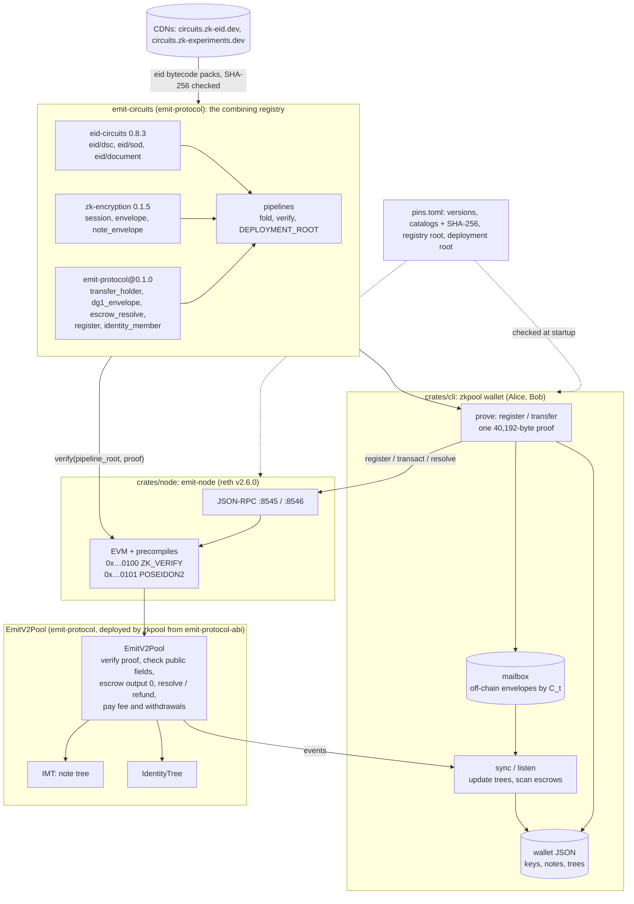
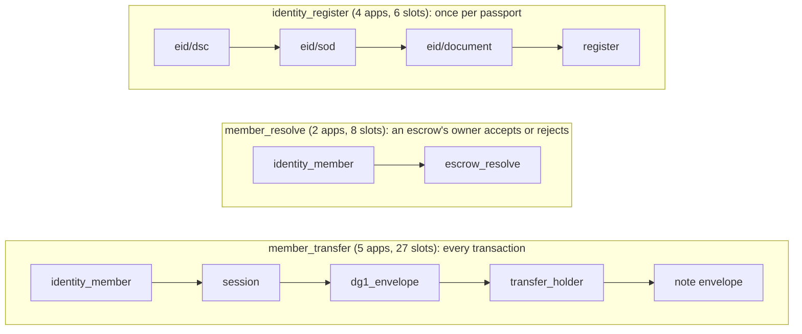

# emit-devnet

The Emit V2 private transfer, end to end on a local chain: a reth dev node whose EVM verifies folded Chonk proofs (`ZK_VERIFY`) and hashes with the circuits' Poseidon2 (`POSEIDON2`), a private note pool contract, and a console wallet (`zkpool`) with which Alice and Bob, each bound to a synthetic passport, deposit, pay each other on the post-quantum channel, split, merge and withdraw. Each holder first registers in the pool's identity cache, proving the passport once (`identity_register`: eid's steps, then the registration); every transaction after that is one proof folded with noir-zk's generic kernels, of `member_transfer` (membership in the identity tree, the channel session, DG1 sealed, the 2-in / 2-out JoinSplit bound to the registered key, and its note opening sealed; see emit-protocol's [circuits](https://github.com/zk-experiments/emit-protocol#the-circuits)). Every note is 0 or at least 1/3 ETH.

The recipient's note is escrowed: the pool holds output 0 until its owner resolves it, a second proof of `member_resolve` (membership, then the resolve) that accepts it (the note, less a fee, enters the tree) or rejects it (the sender's refund note does); after the escrow window anyone may refund it to the sender. The sealed DG1 and the lattice ciphertext travel off-chain, keyed by the transfer's chain commitment `C_t` (on the devnet a directory the wallets share, the *mailbox*; outside it the envelope-inbox service): the chain carries only `env_commit`, a commitment to them, so no personal data (not even encrypted) is written to it, and the receiver can screen the sender's MRZ before taking the funds. See emit-protocol's [escrow](https://github.com/zk-experiments/emit-protocol#the-escrow).

**What lives where.** The protocol (its circuits, the pool contract, and the crates
`emit-protocol`, `emit-protocol-abi`, `emit-circuits`) is
[emit-protocol](https://github.com/zk-experiments/emit-protocol): **what** a transfer carries and
the rules the chain **enforces**. This repository runs it: the node with its precompiles, the
console wallet, the devnet scripts and demo, and the mailbox, its stand-in for the **delivery**
layer (envelope-inbox outside the devnet). The crates (`emit-protocol`, `emit-protocol-abi`,
`emit-circuits` 0.1.0) come from crates.io.

Design: `emit-v2-transfer-mechanism.md` and `emit-private-transfer-design.md` (the Outbe notes); the circuits and wallet logic come from the `postquantum-zk-encryption-experiment` repository, the channel from [zk-encryption](https://github.com/zk-experiments/zk-encryption), the identity layer from [eid-circuits](https://github.com/zk-experiments/eid-circuits), the pipelines from [noir-zk](https://github.com/zk-experiments/noir-zk).

## Architecture



- `ZK_VERIFY(pipeline_root ‖ proof)` returns the proof's `uint256[35]` public fields or reverts. `POSEIDON2(x₁..xₙ)` is Noir's sponge.
- `EmitV2Pool` calls `ZK_VERIFY`, then checks every public field against the calldata: ctx, roots, nullifiers, the identity root (the registry root, date and scope for a registration), the date and `msg.value`. It appends output 1, escrows output 0 with its refund note until the owner resolves it (a `member_resolve` proof) or the window passes, emits `env_commit` for the off-chain envelope, pays the fee to `block.coinbase` and `vPubOut` to the payout address.
- Both trees are `IMT`s of depth 32 that keep every root they had: a proof against an older root stays valid.
- The wallet follows `NewCommitment`, `NewNullifier`, `Envelope`, `Escrowed`, `EscrowClosed` and `IdentityRegistered`. With the off-chain envelope from the mailbox, `Receiver::scan` recovers the escrowed notes sent to it and the sender's MRZ.
- The wallet JSON holds `sk`, the Receiver and Senders, the notes, the escrows (received and sent), the registration, and each tree's frontier with the paths of the wallet's own leaves.

The pipelines, each folded into one proof by noir-zk's generic kernels:



Setup: the eid DSC/SOD/document bytecode comes from the packs on circuits.zk-eid.dev (catalog SHA-256 pinned, pack SHA-256 from the catalog, every file checked against eid's registry pins); the channel layer is zk-encryption-circuits 0.1.5, whose frozen library identity is `zk-encryption@0.1.3`; eid-circuits 0.8.3's is still `eid-circuits@0.8.2`.

```
crates/node/       src/main.rs (reth CLI + EVM factory), src/precompiles.rs, tests/devnet.rs
crates/cli/        src/{main.rs, wallet.rs, chain.rs, emit.rs, identity.rs, tree.rs, document.rs,
                   mailbox.rs},
                   fixtures/documents.json (six synthetic passports), tests/cli.rs
scripts/           devnet.sh (node + `zkpool deploy`), demo.sh (the whole flow, checked), srs.sh (bb's CRS)
.github/workflows/ ci.yml (every test, the proving and devnet ones included)
genesis.json       chain 3607, Prague from genesis, 300M gas limit, three funded dev accounts
```

## Pins and where each artefact comes from

emit-circuits' `pins.toml` is compiled into the node and the wallet and checked at startup (`emit_circuits::pins`): the node refuses to start and the wallet refuses to prove if a check fails (`emit-node node --pins-offline` checks only the local ones).

| what | version / pin | from | checked |
|---|---|---|---|
| noir-zk (core, backend, codegen, kernels) | `=0.3.3` | crates.io | kernels family root `0x297133fa…ae43` and version |
| the protocol's layers (emit: transfer_holder, dg1_envelope, escrow_resolve; identity_cache: register, member) | `emit-protocol@0.1.0`, family roots `transfer_holder` `0x18ee3ff5…efc7`, `dg1_envelope` `0x0b7d4c28…3119`, `escrow_resolve` `0x04c880b8…2757`, `register` `0x1d0042a0…c1eb`, `member` `0x00f3d510…0a75` | emit-protocol (`noir/`, frozen into `emit-circuits` with `noir-zk freeze`, bytecode bundled) | library and every family root; bytecode against its pin when loaded |
| channel layer | `zk-encryption-circuits` 0.1.5 from crates.io (library `zk-encryption@0.1.3`, on noir-zk 0.3.3) | bytecode bundled in `zk-encryption-circuits`; catalog `https://circuits.zk-experiments.dev/zk-encryption/0.1.5/catalog.json` | catalog SHA-256 `b797c5ed…bb81`; its families' roots equal the compiled-in ones |
| identity layer | `eid-circuits` 0.8.3 from crates.io (frozen library `eid-circuits@0.8.2`), `eid-prover` by git tag `v0.8.3` | DSC, SOD and document steps: packs on `https://circuits.zk-eid.dev`, catalog `catalog@0.8.2.json` (0.8.3 didn't refreeze: the same pinned bytecode) | catalog SHA-256 `4de0e4f0…53eb`, its version and its DSC/SOD/document labels in eid's registry; each pack's SHA-256 against the catalog; every unpacked `.b64` / `.vk` against eid's registry pins |
| CSCA registry | tag `registry-20260928-1039`, root `0x27bef40a…02a2` | `https://registry.zk-eid.dev/<tag>/registry.json` | file SHA-256 `17a21c0f…4444` and `commitment.root` |
| deployment | root `0x02d515b4…a88a`; `identity_register` `0x0a2bcc6a…55cf` (4); `member_transfer` `0x0185c63e…ee6c` (5); `member_resolve` `0x23173a42…6853` (2) | computed by emit-circuits' codegen | equal to the generated constants |
| pool contract | `EmitV2Pool` from emit-protocol (solc 0.8.30) | `emit-protocol-abi`'s artifact (ABI and bytecode); `zkpool deploy` deploys it | emit-protocol's CI checks the artifact against `forge build` |
| toolchain | bb 7.0.0-nightly.20260927 (via `barretenberg-rs`), reth v2.6.0 | crates.io, git tag | the Noir and Solidity toolchains are emit-protocol's |

Caches: `~/.cache/emit-protocol` (`$EMIT_PROTOCOL_CACHE`): the pinned files, eid's unpacked packs (the demo needs common, rsa4096, rsa2048, bp384, bp256: about 300 MB). The prover reads bb's CRS from `~/.bb-crs` (`$BB_CRS_PATH`), checked against noir-zk's pinned hashes; `scripts/srs.sh` provisions it.

## Running it

Prerequisites: Rust 1.94+, emit-protocol checked out next to this repository (`../emit-protocol`), Foundry's `cast` (the devnet test reads balances with it), bb's CRS in `~/.bb-crs` (`scripts/srs.sh`), network access the first time. On Linux, libc++ (`libc++-dev libc++abi-dev`: bb's static library links against it).

```sh
scripts/demo.sh                      # builds, starts the node, deploys, runs Alice and Bob, checks balances
cargo test -- --ignored devnet       # the same as a test, against a spawned node (ports 28545-28551, 30545)
cargo test -- --ignored holder       # proves member_transfer with another key than the registered one: refused
cargo test                           # unit tests: pins, pipelines, precompiles, the trees, the CLI offline
```

The circuits' and the contract's own tests (`nargo test`, `forge test`, `freeze --check`) are emit-protocol's. CI (`.github/workflows/ci.yml`) runs the above on every push and pull request, plus `cargo fmt` and clippy, with emit-protocol checked out alongside; the demo script itself is the devnet test's flow, run by hand.

By hand: `source scripts/devnet.sh` starts the node (`.devnet/`) and deploys the pool, exporting `ZKPOOL_POOL`, `ZKPOOL_HOME`, `ZKPOOL_RPC`, `ZKPOOL_WS`; then:

```sh
zkpool identity new --name alice --document us_rsa4096_rsa2048
zkpool identity new --name bob --document de_bp384_bp256
zkpool -w alice contact add --name bob --bundle "$(cat $ZKPOOL_HOME/bob.bundle)"
zkpool -w alice identity register              # the passport proved once: required before any transaction
zkpool -w bob identity register
zkpool -w bob listen &                       # Ctrl-C to stop, or --until N / --timeout S
zkpool -w alice deposit --amount 100
zkpool -w alice transfer --to bob --amount 60   # the handshake, escrowed until Bob resolves it
zkpool -w alice transfer --to bob --amount 5    # the ratchet
zkpool -w bob escrows                        # the escrows addressed to Bob, with the sender's MRZ
zkpool -w bob resolve --all                  # accept them (--reject hands one back)
zkpool -w bob notes
zkpool -w bob split --amounts 10,49.99
zkpool -w bob merge
zkpool -w bob withdraw --amount 30 --to 0x3C44CdDdB6a900fa2b585dd299e03d12FA4293BC
zkpool -w bob balance
```

The node alone: `emit-node node --dev --chain genesis.json --http --ws` (all of reth's flags apply). The pool: `scripts/devnet.sh` runs `zkpool deploy`, which deploys `EmitV2Pool` from emit-protocol-abi's bytecode with the pinned deployment and pipeline roots (`--escrow-window`, default one day) and accepts the fixtures' CSCA registry root and the published one; the deployer's first contract is `0x5FbDB2315678afecb367f032d93F642f64180aa3`.

Dev accounts: accounts 0–2 of the public Anvil/Hardhat test mnemonic (`test test … junk`), whose private keys are published in Foundry's and Hardhat's documentation; funded with 10⁹ ETH in `genesis.json`. They are public knowledge: never use them, or send funds to them, on any real network.

| role | address | private key |
|---|---|---|
| deployer (pool owner) | `0xf39Fd6e51aad88F6F4ce6aB8827279cffFb92266` | `0xac0974bec39a17e36ba4a6b4d238ff944bacb478cbed5efcae784d7bf4f2ff80` |
| Alice | `0x70997970C51812dc3A010C7d01b50e0d17dc79C8` | `0x59c6995e998f97a5a0044966f0945389dc9e86dae88c7a8412f4603b6b78690d` |
| Bob | `0x3C44CdDdB6a900fa2b585dd299e03d12FA4293BC` | `0x5de4111afa1a4b94908f83103eb1f1706367c2e68ca870fc3fb9a804cdab365a` |

## Demo scenario

`scripts/demo.sh` runs the whole flow below and checks it; this section walks through it step by step, with the output of one run (Apple M5 Max; tx hashes, keys and commitments shown as `0x…`, timings as ≈, gas as measured). Every `zkpool` command reads `ZKPOOL_POOL`, `ZKPOOL_HOME`, `ZKPOOL_RPC` and `ZKPOOL_WS` from the environment `scripts/devnet.sh` exports. Alice holds the US fixture (RSA-4096 CSCA → RSA-2048 DSC), Bob the German one (brainpoolP384 → brainpoolP256); both are synthetic passports of the same specimen holder, so their MRZs differ only in the country.

What any observer can read from a `transact`: its calldata (the pipeline root, the note tree root, the two nullifiers and commitments, `vPubIn`, `vPubOut`, `fee`, `payout` and the 40,192-byte proof) and, by running `ZK_VERIFY` on that proof, every public slot; the events; the sending EOA (devnet only, see [What is devnet-only](#what-is-devnet-only)). Every transaction proves the same pipeline, so they all have one shape. None of it says who pays whom or how much moves inside the pool: nullifiers aren't linkable to the commitments they spend, commitments hide their owner and value, the note envelope is a ciphertext, and the sealed DG1 and the lattice ciphertext aren't on-chain at all (only `env_commit`, a commitment to them). A `resolve` shows which escrow closed and whether it was accepted (a new leaf and a fee) or rejected (the refund leaf), not by whom.

### 1. Start the node and deploy the pool

```sh
source scripts/devnet.sh
```

Starts `emit-node node --dev` on `genesis.json` (datadir `.devnet/chain`, http 8545, ws 8546), checks the pins, then deploys with `zkpool deploy` from the deployer account.

```
pins: ok  emit-protocol layers emit-protocol@0.1.0 family roots (transfer_holder, dg1_envelope, escrow_resolve, register, member)
pins: ok  deployment root 0x02d515b4c11b8b715af4d6fa14644a3e7e8dcc52dd9923f3424f1304561da88a
pins: ok  pipeline identity_register root 0x0a2bcc6a85b08c9ee3046ec9387b53a583e188447c51ce7a45cc989702e855cf length 4
pins: ok  pipeline member_transfer root 0x0185c63e50408ddc230b73c27e117be74fe278a964be0e45def5cdc527a8ee6c length 5
pins: ok  pipeline member_resolve root 0x23173a425869da40ad85bb78639280b69ccc656121c183cfba1e6e575bcd6853 length 2
…
precompiles: ZK_VERIFY at 0x0000000000000000000000000000000000000100 (1200000 gas + 3/word), POSEIDON2 at 0x0000000000000000000000000000000000000101 (60 + 360/permutation)
node pid …, rpc http://127.0.0.1:8545, EmitV2Pool 0x5FbDB2315678afecb367f032d93F642f64180aa3
```

On-chain: the `EmitV2Pool` constructor stores the deployment root, the three accepted pipeline roots (`identity_register`, `member_transfer`, `member_resolve`) and the escrow window (a day), and creates its `IdentityTree`; two `addRegistryRoot` calls accept the fixtures' CSCA registry root and the published one (`RegistryRoot` ×2).

### 2. Identities

```sh
zkpool identity new --name alice --document us_rsa4096_rsa2048
zkpool identity new --name bob --document de_bp384_bp256
```

Each binds a fixture passport, draws the shielded key `sk` (address `pk = H("emit-v2/pk", sk)`) and the receiver's Grumpkin and ML-KEM-768 keys, writes `$ZKPOOL_HOME/<name>.json` and the bundle `$ZKPOOL_HOME/<name>.bundle` (printed; `zkpool -w <name> identity show` prints it again).

```
identity alice: passport us_rsa4096_rsa2048 (P<USAERIKSSON<<ANNA<MARIA<<<<<<<<<<<<<<<<<<<L898902C36USA7408122F3404159ZE184226B<<<<<16)
  EOA 0x70997970C51812dc3A010C7d01b50e0d17dc79C8
  shielded address pk 0x…
identity bob: passport de_bp384_bp256 (P<D<<ERIKSSON<<ANNA<MARIA<<<<<<<<<<<<<<<<<<<L898902C36D<<7408122F3404159ZE184226B<<<<<16)
  EOA 0x3C44CdDdB6a900fa2b585dd299e03d12FA4293BC
  shielded address pk 0x…
```

On-chain: nothing.

### 3. Bundles exchanged

```sh
zkpool -w alice contact add --name bob --bundle "$(cat $ZKPOOL_HOME/bob.bundle)"
zkpool -w bob contact add --name alice --bundle "$(cat $ZKPOOL_HOME/alice.bundle)"
```

Each checks the other's bundle (format, chain id, validity window, the Grumpkin key on the curve, the ML-KEM key and its commitment) and keeps it as a contact, the prerequisite for a handshake.

```
alice: contact bob accepted (pk 0x…, valid until …)
bob: contact alice accepted (pk 0x…, valid until …)
```

On-chain: nothing; bundles travel out of band.

### 4. Each registers in the identity cache

```sh
zkpool -w alice identity register
zkpool -w bob identity register
```

Proves `identity_register` (eid's DSC, SOD and document steps for the passport, with the document in this epoch's registration scope read from the pool, then `register`), with a fresh blinding `r`, verifies it locally and sends `register(proof)`. The expiry is the epoch's last second or the passport's expiry, whichever is first. In the epoch's last day (`RENEWAL_WINDOW`) the wallet registers for the next epoch instead, valid at once and until that epoch ends, so a registration never lasts less than a day. A wallet with no live registration can't transact: `deposit`, `transfer` and the rest refuse with a pointer to `identity register`.

```
alice: registered (identity leaf 0, valid until …): identity_register proved in ≈1.7 s (40192 B proof, verified locally in 18 ms), gas 2574895 (40260 B calldata), block 2, tx 0x…
bob: registered (identity leaf 1, valid until …): identity_register proved in ≈4.0 s (40192 B proof, verified locally in 18 ms), gas 2007864 (40260 B calldata), block 3, tx 0x…
```

On-chain: `register(bytes proof)`, calldata the proof alone. `ZK_VERIFY` returns 6 slots: `registry_root, date, scope, nullifier, leaf, expiry`. The pool checks the registry root is accepted, the date is within a day of the block time, `scope = registrationScope(date / 7 days)` (or, in the epoch's last day, the next epoch's), the document's nullifier is unused and `date ≤ expiry` < that epoch's end; then writes `documentRegistered[nullifier]`, appends the leaf to the identity tree (its new root joins the known roots) and emits `IdentityRegistered(leaf, index, expiry)`. Alice's is the first insert and writes the tree's filled subtrees, hence 2.58M gas against Bob's 2.01M. An observer sees the leaf, its index and expiry, the scoped nullifier, the date and the sending EOA, but the leaf is blinded: Bob, who knows Alice's address and will read her MRZ, can't tell which registration is hers. The wallet stores the leaf, index, DG1 salt, expiry and `r`.

### 5. Bob listens

```sh
zkpool -w bob listen --until 2 --timeout 900 &
```

Subscribes to the pool's logs over WebSocket and syncs on each new block's events; stops after 2 notes received into escrow.

### 6. Alice deposits 100

```sh
zkpool -w alice deposit --amount 100
```

Every transaction proves `member_transfer`: `identity_member` (her leaf under the current identity root, today's date, a fresh DG1 commitment, the holder tag), the channel session, the DG1 envelope, `transfer_holder` and the note envelope. The inputs are two dummy notes of her own key (fresh nullifiers), the outputs a zero note (output 0, escrowed and never resolved) and the 100 ETH note to herself (output 1, appended at once; every output is 0 or at least 1/3 ETH, which `transfer_holder` checks); the channel is a throwaway (nobody can open the envelopes, so the wallet puts nothing in the mailbox); fee 0.

```
alice: deposit 100 ETH: member_transfer proved in ≈1.3 s (40192 B proof, verified locally in 18 ms), gas 2690673 (40580 B calldata), block 4, tx 0x…
```

On-chain: `transact(pipeline = member_transfer root, root, nullifiers[2], commitments[2], vPubIn = 100 ETH, vPubOut = 0, fee = 0, payout = 0, proof (40,192 B))` with `msg.value = 100 ETH`. `ZK_VERIFY` returns 27 slots: `identity_root, date, holder_tag`; the session's `ctx, C_t, E.x, E.y, tag, ct_commitment`; the DG1 envelope's `cid_commit`; the transfer's `cid, root, N₀, N₁, C₀, C₁, C_r, v_in, v_out, fee, payout`; the note envelope's `c_note0..5`. The pool checks the identity root is one the identity tree had, the date, every transfer field against the calldata, `ctx = H("emit-v2/ctx", cid, N₀, N₁, C₀, C₁)`, the note root one the note tree had, the nullifiers unspent and distinct, and `msg.value = vPubIn`. It marks both nullifiers spent, appends C₁ (note tree leaf 0), escrows C₀ with C_r and emits `NewNullifier` ×2, `NewCommitment(C₁, 0)`, `Escrowed(1, C₀, C_t, env_commit, deadline)` and `Envelope(cT, e, tag, ct, cNote)`. The first deposit pays for the note tree's first writes (2.69M gas; later transfers ≈2.13-2.14M). An observer sees 100 ETH enter from Alice's EOA (`vPubIn` is public); who owns the result, and that output 0 is empty, are hidden.

### 7. Alice pays Bob 60 (the handshake)

```sh
zkpool -w alice transfer --to bob --amount 60
```

The first transfer to a contact is the handshake: the session encapsulates to Bob's Grumpkin and ML-KEM keys, the DG1 envelope seals Alice's MRZ and the note envelope output 0's opening (value and randomness) under the new chain key. Inputs: her 100 note and a dummy; outputs: 60 to Bob's `pk` (escrowed), 39.99 change to herself; fee 0.01 (the default). Before sending, the wallet writes the off-chain envelope (`u ‖ v`, then `c_id`: 1,728 bytes) to the mailbox under `C_t`, and keeps the refund note C_r among its pending notes.

```
alice: transfer 60 ETH to bob (handshake), in escrow until bob resolves it: member_transfer proved in ≈1.3 s (40192 B proof, verified locally in 21 ms), gas 2137955 (40580 B calldata), block 5, tx 0x…
```

On-chain: `transact` as in step 6 with `vPubIn = vPubOut = 0`, `fee = 0.01 ETH`, paid from the shielded value to `block.coinbase`. Note tree leaf 1 (the change); escrow 2 (`Escrowed(2, …)`). An observer sees a member transfer with a 0.01 ETH fee from Alice's EOA and nothing of its receiver, its amount or the sender's identity. Bob's wallet reads the envelope for `C_t` from the mailbox, checks it opens `env_commit`, and runs `Receiver::scan`: it first looks `C_t` up in the chain-key windows he holds, then tests the tag against his bundle's keys; this one matches the tag, so he derives the channel's first chain key from `E` and the lattice ciphertext (his ML-KEM key), opens `c_note` (checking it opens `C₀` for his `pk`) and `c_id` (Alice's MRZ), and keeps the escrow to resolve.

### 8. Alice pays Bob 5 (the ratchet)

```sh
zkpool -w alice transfer --to bob --amount 5
```

The second transfer to Bob advances the channel's ratchet (the session encapsulates to a throwaway key: every transfer has one shape). Inputs: the 39.99 change; outputs: 5 to Bob (escrowed), 34.98 to herself.

```
alice: transfer 5 ETH to bob (ratchet index 1), in escrow until bob resolves it: member_transfer proved in ≈1.3 s (40192 B proof, verified locally in 25 ms), gas 2137824 (40580 B calldata), block 6, tx 0x…
```

On-chain: `transact` as in step 7. Note tree leaf 2; escrow 3. An observer can't tell a handshake from a ratchet. Bob finds it by `C_t` in the window of chain keys he holds for the channel.

Bob's listener, meanwhile:

```
bob: listening to 0x5FbDB2315678afecb367f032d93F642f64180aa3 (block 3)
bob: received 60 ETH (handshake, block 5) from P<USAERIKSSON<<ANNA<MARIA<<<<<<<<<<<<<<<<<<<L898902C36USA7408122F3404159ZE184226B<<<<<16, in escrow: zkpool resolve
bob: received 5 ETH (ratchet index 1, block 6) from P<USAERIKSSON<<ANNA<MARIA<<<<<<<<<<<<<<<<<<<L898902C36USA7408122F3404159ZE184226B<<<<<16, in escrow: zkpool resolve
bob: stopped; 2 note(s) received into escrow, balance 0 ETH
```

### 9. Bob screens the escrows and accepts them

```sh
zkpool -w bob escrows
zkpool -w bob resolve --all
zkpool -w bob notes
```

The escrows list the sender's MRZ (from the DG1 whose signature chain Alice's registration proved) before Bob takes anything. `resolve --all` accepts each: it proves `member_resolve` (his membership, then `escrow_resolve`: he opens C₀ with his `sk`, and the kept note is C₀'s value less the fee, 0 here, for his key) and sends `resolve(proof)`.

```
bob: 2 escrow(s) addressed here
  in   0x19f4fb3567c8421b            60 ETH  handshake, until …  from P<USAERIKSSON<<ANNA<MARIA<<<<<<<<<<<<<<<<<<<L898902C36USA7408122F3404159ZE184226B<<<<<16
  in   0x20854e3a8fd6d611             5 ETH  ratchet index 1, until …  from P<USAERIKSSON<<ANNA<MARIA<<<<<<<<<<<<<<<<<<<L898902C36USA7408122F3404159ZE184226B<<<<<16
bob: accept 60 ETH (handshake) from P<USAERIKSSON<<…: member_resolve proved in ≈0.8 s (40192 B proof, verified locally in 19 ms), gas 1987491 (40260 B calldata), block 7, tx 0x…
bob: accept 5 ETH (ratchet index 1) from P<USAERIKSSON<<…: member_resolve proved in ≈0.6 s (40192 B proof, verified locally in 26 ms), gas 1990320 (40260 B calldata), block 8, tx 0x…
bob: 2 note(s), 65 ETH
  leaf    3            60 ETH  0x…  from P<USAERIKSSON<<ANNA<MARIA<<<<<<<<<<<<<<<<<<<L898902C36USA7408122F3404159ZE184226B<<<<<16
  leaf    4             5 ETH  0x…  from P<USAERIKSSON<<ANNA<MARIA<<<<<<<<<<<<<<<<<<<L898902C36USA7408122F3404159ZE184226B<<<<<16
```

On-chain: `resolve(bytes proof)`, calldata the proof alone. `ZK_VERIFY` returns 8 slots: `identity_root, date, holder_tag, cid, c0, action, c_out, fee`. The pool checks the identity root, the date, `cid`, that C₀ is escrowed and (on accept) within its window; it closes the escrow (`EscrowClosed(seq, C₀)`), appends `c_out` (note tree leaves 3 and 4) and pays the fee. Each wallet then deletes the mailbox file of the closed escrow, and Alice's wallet forgets the refund notes it kept pending.

### 10. Alice pays Bob 2 more; Bob rejects it

```sh
zkpool -w alice transfer --to bob --amount 2
zkpool -w bob resolve --all --reject
```

```
alice: transfer 2 ETH to bob (ratchet index 2), in escrow until bob resolves it: member_transfer proved in ≈1.3 s (40192 B proof, verified locally in 21 ms), gas 2134867 (40580 B calldata), block 9, tx 0x…
bob: received 2 ETH (ratchet index 2, block 9) from P<USAERIKSSON<<…, in escrow: zkpool resolve
bob: reject 2 ETH (ratchet index 2) from P<USAERIKSSON<<…: member_resolve proved in ≈0.8 s (40192 B proof, verified locally in 21 ms), gas 1986925 (40260 B calldata), block 10, tx 0x…
```

On-chain: the transfer as in step 8 (leaf 5, Alice's 32.97 change; escrow 6); the reject closes the escrow and appends the refund note C_r (leaf 6), which Alice's wallet finds among its pending notes: 32.97 + 2. Had Bob done nothing, anyone could have called `refund(C₀)` after the window, to the same effect.

### 11. Bob splits, merges and withdraws

```sh
zkpool -w bob split --amounts 10,49.99
zkpool -w bob merge
zkpool -w bob withdraw --amount 30 --to 0x3C44CdDdB6a900fa2b585dd299e03d12FA4293BC
```

Three `member_transfer` transactions to himself, each on a throwaway channel with the default 0.01 fee: the 60 note into 10 + 49.99 (both kept, so the 10, output 0, is escrowed and the wallet accepts it at once: a second proof); the two smallest (5 and 10) into 14.99 (output 1); 30 out of the 49.99 note to his EOA (`vPubOut = 30 ETH`, `payout` = his address), 19.98 back to himself (output 1).

```
bob: split 1 -> 2 (10 + 49.99 ETH): member_transfer proved in ≈1.3 s (40192 B proof, verified locally in 20 ms), gas 2131981 (40580 B calldata), block 11, tx 0x…
bob: accept own escrow: member_resolve proved in ≈0.6 s (40192 B proof, verified locally in 19 ms), gas 1990418 (40260 B calldata), block 12, tx 0x…
bob: merge 2 -> 1 (14.99 ETH): member_transfer proved in ≈1.3 s (40192 B proof, verified locally in 19 ms), gas 2135013 (40580 B calldata), block 13, tx 0x…
bob: withdraw 30 ETH to 0x3C44CdDdB6a900fa2b585dd299e03d12FA4293BC: member_transfer proved in ≈1.4 s (40192 B proof, verified locally in 18 ms), gas 2142483 (40580 B calldata), block 14, tx 0x…
  0x3C44CdDdB6a900fa2b585dd299e03d12FA4293BC: 999999999.99533… -> 1000000029.99499… ETH
```

On-chain: `transact` each, as in step 7 (note tree leaves 7-10), and a `resolve`. The withdrawal pays 30 ETH from the pool to `payout`, which an observer sees, with the fee; a split, a merge and a payment to someone else look the same on-chain.

### 12. A note below the minimum is refused

```sh
zkpool -w bob split --amounts 0.1
```

Every output note is 0 or at least 1/3 ETH (`MIN_NOTE_VALUE`, 333,333,333,333,333,333 wei). `transfer_holder` and `escrow_resolve` assert it, so no valid proof creates a smaller note; the wallet checks it before proving, to fail early and clearly.

```
Error: a 0.1 ETH note is below the minimum of 0.333333333333333333 ETH (a note is 0 or at least 1/3 ETH)
```

On-chain: nothing. A change of less than 1/3 ETH can't be kept either: pay it out with the rest, or leave a larger change.

### 13. Balances

```sh
zkpool -w alice balance
zkpool -w bob balance
zkpool -w bob notes
cast balance $ZKPOOL_POOL --rpc-url $ZKPOOL_RPC
```

```
alice: shielded 34.97 ETH in 2 note(s); EOA 0x70997970C51812dc3A010C7d01b50e0d17dc79C8 999999899.99370… ETH
bob: shielded 34.97 ETH in 2 note(s); EOA 0x3C44CdDdB6a900fa2b585dd299e03d12FA4293BC 1000000029.99499… ETH
bob: 2 note(s), 34.97 ETH
  leaf    9         14.99 ETH  0x…
  leaf   10         19.98 ETH  0x…
pool contract holds 69.94 ETH (= 34.97 + 34.97 shielded)
```

Alice: 100 − 60 − 5 − 3 × 0.01 (the 2 came back). Bob: 65 − 30 − 3 × 0.01. The pool holds exactly the shielded total; the six fees went to the block producers.

### Summary

| step | call | pipeline | prove | gas | calldata | events | state written |
|---|---|---|---:|---:|---:|---|---|
| Alice registers | `register` | `identity_register` | ≈1.7 s | 2,574,895 | 40,260 B | `IdentityRegistered` | `documentRegistered`, identity leaf 0 (first insert: filled subtrees), its root known |
| Bob registers | `register` | `identity_register` | ≈4.0 s | 2,007,864 | 40,260 B | `IdentityRegistered` | `documentRegistered`, identity leaf 1, its root known |
| Alice deposits 100 | `transact` | `member_transfer` | ≈1.3 s | 2,690,673 | 40,580 B | `NewNullifier` ×2, `NewCommitment`, `Escrowed`, `Envelope` | 2 nullifiers, note leaf 0 (first insert: filled subtrees), its root known, escrow 1 (empty); +100 ETH to the pool |
| Alice → Bob 60 (handshake) | `transact` | `member_transfer` | ≈1.5 s | 2,137,955 | 40,580 B | the same | 2 nullifiers, note leaf 1, escrow 2; fee to coinbase; the envelope in the mailbox |
| Alice → Bob 5 (ratchet) | `transact` | `member_transfer` | ≈1.5 s | 2,137,824 | 40,580 B | the same | 2 nullifiers, note leaf 2, escrow 3; fee to coinbase |
| Bob accepts 60 | `resolve` | `member_resolve` | ≈1.0 s | 1,987,491 | 40,260 B | `EscrowClosed`, `NewCommitment` | escrow 2 closed, note leaf 3 |
| Bob accepts 5 | `resolve` | `member_resolve` | ≈0.6 s | 1,990,320 | 40,260 B | the same | escrow 3 closed, note leaf 4 |
| Alice → Bob 2 | `transact` | `member_transfer` | ≈1.3 s | 2,134,867 | 40,580 B | as Alice's other transfers | 2 nullifiers, note leaf 5, escrow 6; fee to coinbase |
| Bob rejects 2 | `resolve` | `member_resolve` | ≈0.8 s | 1,986,925 | 40,260 B | `EscrowClosed`, `NewCommitment` | escrow 6 closed, note leaf 6 (Alice's refund) |
| Bob splits | `transact`, `resolve` | `member_transfer`, `member_resolve` | ≈1.3 s + 0.8 s | 2,131,981 + 1,990,418 | 40,580 + 40,260 B | the same | note leaves 7-8, escrow 7 opened and closed; fee to coinbase |
| Bob merges | `transact` | `member_transfer` | ≈1.3 s | 2,135,013 | 40,580 B | the same | 2 nullifiers, note leaf 9, escrow 8 (empty); fee to coinbase |
| Bob withdraws 30 | `transact` | `member_transfer` | ≈1.4 s | 2,142,483 | 40,580 B | the same | 2 nullifiers, note leaf 10, escrow 9 (empty); fee to coinbase, 30 ETH to payout |

## The precompiles

`ZK_VERIFY` at `0x0000000000000000000000000000000000000100`: input `pipeline_root (32 bytes) ‖ proof` (a whole number of 32-byte fields). The pipeline must be one of the pinned deployment's (`identity_register`, `member_transfer`, `member_resolve`); the proof is verified under noir-zk's hiding key with the deployment root, the pipeline root and length checked, and the output is every public field ABI-encoded as `uint256[]`: `deployment_root, pipeline_root, length`, then the 32 slots, the pipeline's in order and zeros after (always 35 fields). A proof that doesn't verify reverts with the reason as bytes, after charging the gas. Gas: `1,200,000 + 3 per 32-byte word`: verification takes 17-20 ms on an Apple M5 Max (the wallet times it before each send), priced at ecrecover's rate (3,000 gas for about 50 µs, 60 Mgas/s); with the 40,224-byte input that is 1,203,771. The outcome is cached by the input's keccak256 (1,024 entries): reth runs every transaction twice, building the block and validating it, and the second run is a lookup; the gas is the same either way.

`POSEIDON2` at `0x0000000000000000000000000000000000000101`: input `n ≥ 1` 32-byte big-endian field elements, each below the BN254 scalar modulus (otherwise it halts); returns Noir's `Poseidon2::hash(inputs, n)` (t = 4, rate 3, the same `pso-poseidon` code the circuits' Rust mirror uses). Gas: `60 + 360 per permutation`, one permutation per three inputs (a tree node: 420; `env_commit`, 3 inputs: 420).

## The contract

`EmitV2Pool` and its `IMT` trees are emit-protocol's: see its [contract](https://github.com/zk-experiments/emit-protocol#the-contract) section for every entry point, event, view and error. This repository deploys it (`zkpool deploy`) from `emit-protocol-abi`'s bytecode and talks to it through that crate's bindings. The wallet's tree (`crates/cli/src/tree.rs`) computes the same roots as `IMT`, and a test checks the empty root.

## The wallet

`zkpool [--home DIR] [--rpc URL] [--ws URL] [--pool ADDR] [-w NAME] [--chain-id 3607] <command>` (each also from `ZKPOOL_*`); amounts in ETH. Every transaction proves `member_transfer` and needs a live registration; every note it creates is 0 or at least 1/3 ETH.

| command | what it does |
|---|---|
| `info [--check]` | the deployment and pipeline roots, the fixtures' registry root and the published one, the pin checks (`--check` fetches the catalogs and registry) |
| `identity new --name N --document D [--key K]` | binds a fixture passport, generates the shielded key `sk` (`pk = H("emit-v2/pk", sk)`) and the receiver's keys (Grumpkin + ML-KEM-768), writes the wallet and prints the bundle (base64url, also `<home>/<N>.bundle`); alice and bob get their dev EOAs |
| `identity show` | the bundle again |
| `identity register [--force]` | proves `identity_register` (the document in this epoch's registration scope, read from the pool, or in the epoch's last day the next epoch's) and sends `register`; refuses if that wouldn't outlast the live registration, unless `--force`; keeps the leaf, its index, the DG1 salt, the expiry (that epoch's last second or the passport's expiry, whichever is first) and the leaf's blinding `r` (fresh from the OS CSPRNG) in the wallet; a stored registration without `r` (made before the leaf was blinded) refuses to prove membership until registered again |
| `contact add --name N --bundle B` | accepts a bundle (format, chain id, validity window, Grumpkin key on the curve, ML-KEM key and its commitment): the handshake's prerequisite |
| `deposit --amount A [--fee F]` | vPubIn = A from the EOA, dummy inputs, a note of A − F to itself (output 1, appended at once; output 0, escrowed, is empty), on a throwaway channel |
| `transfer --to N --amount A [--fee 0.01]` | spends one or two notes: A to the contact's `pk` (output 0, escrowed until the contact resolves it; its refund note waits in the wallet), the change to itself; the first transfer to a contact is the handshake, later ones ratchet; the channel state is written before broadcasting, the off-chain envelope (u, v, c_id) into the mailbox before sending |
| `withdraw --amount A --to ADDR [--fee 0.01]` | vPubOut = A to ADDR, the change to itself (output 1) |
| `split --amounts a[,b] [--fee 0.01]` | one note into two: `a,b` needs a note worth exactly a + b + fee, `a` alone keeps the rest in the second; `a` is output 0, escrowed, so the wallet accepts its own escrow at once (a `member_resolve` proof) |
| `merge [--fee 0.01]` | the two smallest notes into one (output 1) |
| `escrows` | the escrows addressed here (C₀, value, handshake or ratchet index, deadline, the sender's MRZ) and those this wallet sent |
| `resolve (--escrow C0 \| --all) [--reject] [--fee 0]` | proves `member_resolve` and sends `resolve`: accept (the note less the fee becomes this wallet's) or reject (it returns to the sender); an escrow is named by a prefix of its C₀ |
| `refund --escrow C0` | after the window, hands an escrow this wallet sent back (its refund note returns here); anyone may, it needs no proof |
| `notes`, `balance` | the notes (leaf, value, commitment, sender's MRZ), the shielded and EOA balances |
| `sync` | catches up from the pool's logs: the note tree, spent notes, the pending outputs (change, accepted escrows, refunds), the identity tree (`IdentityRegistered`, which also gives the wallet's own leaf its index), closed escrows, and every escrowed transfer whose envelope is in the mailbox (and opens `env_commit`) through `Receiver::scan`: a note addressed here becomes an escrow to resolve |

The wallet doesn't keep the trees' leaves. For each tree it keeps the frontier (the last left node at each height, as the contract's filled subtrees) and the path of each of its own leaves, and updates those paths as leaves are appended: 32 hashes per appended leaf plus a comparison per own leaf and height, and 32 fields (about 1 KB of JSON) per own leaf, whatever the tree's size. A spend reads its path; nothing is rebuilt. It still reads every leaf from the events, so it learns nothing from a server and tells none which notes are its. A spent note's path is dropped.
| `listen [--until N] [--timeout S]` | subscribes to the pool's logs over WebSocket and syncs on each, printing notes received into escrow with the sender's MRZ |

Each transaction is proven in-process: identity_member proves the wallet's leaf under the identity tree's current root at today's date and commits DG1 afresh, the DG1 envelope seals it under the transfer's chain key (publishing only a commitment to the ciphertext), and `member_transfer::fold` folds the five apps. The wallet then verifies the proof locally (as `ZK_VERIFY` will) and sends `transact` from its EOA. The fee leaves the shielded value to the block producer. Dummy inputs (deposits, splits) are held by the wallet's own key with fresh nullifiers, as `transfer_holder` requires.

## Measured (Apple M5 Max, 18 cores; `scripts/demo.sh`, one run)

| transaction | passport | pipeline | prove | gas |
|---|---|---|---:|---:|
| Alice registers | US: RSA-4096 → RSA-2048 | `identity_register` | 1.74 s | 2,574,895 |
| Bob registers | DE: brainpoolP384 → brainpoolP256 | `identity_register` | 4.00 s | 2,007,864 |
| Alice deposits 100 | US | `member_transfer` | 1.30 s | 2,690,673 |
| Alice → Bob 60 (handshake) | US | `member_transfer` | 1.31 s | 2,137,955 |
| Alice → Bob 5 (ratchet) | US | `member_transfer` | 1.30 s | 2,137,824 |
| Bob accepts 60 | DE | `member_resolve` | 0.80 s | 1,987,491 |
| Bob accepts 5 | DE | `member_resolve` | 0.62 s | 1,990,320 |
| Alice → Bob 2 | US | `member_transfer` | 1.31 s | 2,134,867 |
| Bob rejects 2 | DE | `member_resolve` | 0.81 s | 1,986,925 |
| Bob splits 60 → 10 + 49.99 (+ accepts his 10) | DE | `member_transfer`, `member_resolve` | 1.31 s + 0.63 s | 2,131,981 + 1,990,418 |
| Bob merges 5 + 10 → 14.99 | DE | `member_transfer` | 1.32 s | 2,135,013 |
| Bob withdraws 30 | DE | `member_transfer` | 1.35 s | 2,142,483 |

A member transfer proves in about 1.3 s whatever the passport (the DG1 envelope app is now smaller, 339 gates against the channel envelope's). Its cost is the fold: the ML-KEM session app (53,381 gates) and the kernels (one step kernel per app, each verifying two folded proofs). A resolve folds two apps (membership and the 3,025-gate `escrow_resolve`) and proves in under a second. A registration costs a proof verification (1.2M), its calldata (40,260 B) and one identity-tree insert (the first one writes the tree's filled subtrees: 2.58M, later ones about 2.0M).

Every proof is 40,192 bytes and verifies in 16-18 ms. A transfer's 2.13-2.14M gas: calldata of 40,580 B (the proof and the transfer's fields; the 1,536-byte ciphertext is gone), 1.20M `ZK_VERIFY`, 34 `POSEIDON2` calls (32 tree nodes, ctx, `env_commit`), and the rest storage (nullifiers, a tree insert, a known root, the escrow), the events and the payments: about 640k less than when the pool decoded and packed the ML-KEM ciphertext in Solidity and appended both outputs. A resolve costs about 1.99M (a proof verification, a tree insert, the escrow closed). The first deposit pays about 550k more for the tree's first writes. The whole demo takes about 45 s with the packs cached (first run: about 300 MB of packs).

## The circuits and the escrow

The apps, pipelines, design decisions and soundness notes (the identity cache, the holder binding, the minimum note, the registration scope) and the escrow (the off-chain envelope, screening then resolving, the refund, the event sequence) are emit-protocol's: see its [circuits](https://github.com/zk-experiments/emit-protocol#the-circuits) and [escrow](https://github.com/zk-experiments/emit-protocol#the-escrow) sections. What is this repository's: the wallet's conventions on top of them (self-transfers keep their note in output 1, a split accepts its own escrow at once) and the mailbox below.

## What is devnet-only

- **Sending from the user's EOA.** The design sends `transact` from a one-time address with a zero gas price, the fee paid only from the shielded value; that needs a zero-fee path (a sequencer or mempool rule admitting such transactions when the proof checks out) that this dev chain doesn't have. Here each user's funded EOA sends and pays gas, which links their transactions to their account; the protocol fee still goes from the shielded value to `block.coinbase`. (reth's dev mode rotates the coinbase per block, so the fees land on throwaway addresses.)
- **Registry roots set by the owner.** The pool accepts the csca-registry roots its owner adds (the deploy adds the fixtures' root and the pinned published one).
- **Synthetic passports.** The six fixtures (US, DE, FR, IT, NL, ES) are mock documents signed by mock CSCAs; the pool accepts their registry's root. Two users may even share a passport.
- **Dev keys and chain.** Well-known keys, chain id 3607, instant blocks, one node; the datadir is thrown away by `scripts/devnet.sh`.
- **The mailbox.** The off-chain envelopes live in a directory the wallets share (`<home>/mailbox`), written by the sender and deleted when the escrow closes; outside the devnet the envelope-inbox service carries them (a deposit keyed by `C_t`, fetched with a token only the two parties know, deleted by its indexer when the escrow closes).
- **Resolves from the EOA.** A resolve is sent from the owner's EOA like every transaction here; its fee argument (paid from the note to `block.coinbase`) is what a relayer would be paid with.

## Gaps

- A registration can't be revoked early (no per-leaf revocation list); the epoch bounds it (7 days, plus a day of date tolerance).
- eid's scoped nullifier can be recomputed by anyone holding the passport's SOD, who can then find its registration (see the privacy note above).
- Output 0 of a deposit, merge or withdrawal is an empty escrow nobody resolves (it is refundable, to a zero-value note): to an observer, an escrow that is never resolved hints at a self-transfer. A wallet that resolves (rejects) its own empty escrows too would hide it, at a proof each.
- The receiver must resolve within the window, or the sender (or anyone) can refund it.
- `ZK_VERIFY`'s gas constant is from one machine.
- A failed ratchet transaction leaves its chain index consumed: its calldata is public even when it reverts, so reusing the key on other plaintext would be key reuse; the receiver's window of 8 absorbs the gap. A failed handshake restarts the contact's channel.
- The Foundry tests mock both precompiles (Foundry's EVM can't load them); the real hash and verifier are exercised by the devnet test and the demo.
